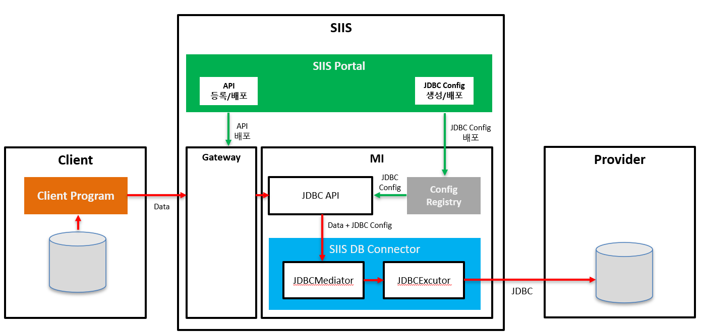

# SIIS DB Connector

설정 기반 JDBC 실행 엔진으로, JSON 입력 데이터를 DB 스키마에 매핑하고 복잡한 트랜잭션 흐름을 제어합니다.

---

## 목차

1. [개요](#1-개요)
2. [주요 특징](#2-주요-특징)
3. [핵심 개념](#3-핵심-개념)
4. [실행 흐름](#4-실행-흐름)
5. [트랜잭션 제어](#5-트랜잭션-제어)
6. [설정 가이드](#6-설정-가이드)
7. [사용 예제](#7-사용-예제)
8. [고급 기능](#8-고급-기능)
9. [에러 처리](#9-에러-처리)
10. [성능 최적화](#10-성능-최적화)
11. [제약사항](#11-제약사항)
12. [배포 가이드](#12-배포-가이드)

---

## 1. 개요

### 1.1 설계 목적

SIIS DB Connector 는 다음 요구사항을 가진 시스템을 위해 설계되었습니다:

- API/Integration Layer에서 DB 연계 로직 코드 제거
- SQL, 프로시저, 트랜잭션 흐름을 설정으로 제어
- JSON 구조와 DB 스키마 간 유연한 매핑
- 하나의 요청에서 다수의 DML + Procedure 혼합 처리
- Operation 단위 명시적 트랜잭션 분리
- Master-Detail 관계 데이터의 원자적 처리

### 1.2 아키텍처

```
Client Request (JSON)
        │
        ▼
Config Loader & Validator
        │
        ▼
JdbcExecutor
 ├─ JSON Parsing
 ├─ Record Extraction
 ├─ Operation Loop
 │   ├─ Batch Collection
 │   ├─ Commit Action Check
 │   ├─ Master-Detail Processing
 │   └─ Transaction Execution
 └─ Result Generation
        │
        ▼
Execution Result (JSON)
```

### 1.3 시스템 구성도



### 구성 요소

### 1) Client 영역
| 구성요소 | 설명 |
|---------|------|
| Client Program | 클라이언트 애플리케이션 |
| Database | 클라이언트 측 데이터베이스 |

### 2) SIIS 플랫폼

#### * SIIS Portal
| 구성요소 | 설명 |
|------|------|
| API 등록/배포 | API 서비스 등록 및 배포 관리 |
| JDBC Config 생성/배포 | API 등록정보를 기반으로 JDBC Config 자동 생성 |

#### * Gateway
- API 요청 라우팅 및 관리

#### * MI (Micro Integrator)
| 구성요소 | 설명 |
|---------|------|
| JDBC API | Client 호출 URL 제공 , SIIS DB Connector 호출 |
| Config Registry | JDBC 설정 정보 저장소 |
| SIIS DB Connector | 데이터베이스 연결 및 데이터 처리 |
| └─ JDBCMediator | MI 엔진으로부터 트리거링 되는 클래스 |
| └─ JDBCExecutor | 실제 JDBC 쿼리 실행 |

### 3) Provider 영역
| 구성요소 | 설명 |
|---------|------|
| Database | 외부 제공자의 데이터베이스 |


## 2. 주요 특징

### 2.1 Zero-Code DB Integration

**기존 방식:**

```java
public void saveUser(UserDto user) {
    userRepository.delete(user.getId());
    userRepository.merge(user);
    callProcedure();
}
```

**SIIS DB Connector:**

```yaml
operations:
  - delete_tb_user
  - insert_tb_user
  - proc_tb_user
```

### 2.2 순수 JDBC 기반

- Named Parameter Binding 자체 구현
- 트랜잭션 경계 명시적 제어

### 2.3 유연한 데이터 매핑

| JSON 필드 | SQL 파라미터 | DB 타입 |
|-----------|--------------|---------|
| id | :USER_ID | INT |
| name | :USER_NAME | VARCHAR |
| crtdt | :CREATED_DATE | DATE |
| addr | :USER_ADDR | CLOB |
| profile | :USER_PROFILE | BLOB |

---

## 3. 핵심 개념

### 3.1 Operation

하나의 SQL 또는 Stored Procedure 실행 단위입니다.

```yaml
  - operation_name: insert_tb_user
    action_type: INSERT
    data_record: data
    commit_action: COMMIT        # COMMIT / CONTINUE
    commit_scope: ALL            # ALL / ROW
  
    sql: |
      INSERT INTO TB_USER(
          USER_ID, USER_NAME, USER_NICK, USER_AGE, USER_SCORE,
          CREATED_DATE, UPDATED_TS, OPTIONAL_COL, IS_ACTIVE,
          USER_ADDR, USER_PROFILE
      ) 
      VALUES (
          :USER_ID, :USER_NAME, :USER_NICK, :USER_AGE, :USER_SCORE,
          :CREATED_DATE, :UPDATED_TS, :OPTIONAL_COL, :IS_ACTIVE,
          :USER_ADDR, :USER_PROFILE
      )
```

### 3.2 Commit Action

Operation의 트랜잭션 처리 방식을 결정합니다.

| Commit Action | 동작 |
|---------------|------|
| `CONTINUE` | 다음 Operation과 묶어서 하나의 트랜잭션으로 처리 |
| `COMMIT` | 현재까지 누적된 Operation을 즉시 커밋하고 트랜잭션 종료 |

⚠️ **중요:** Master-Detail 구조에서 Detail은 Master의 트랜잭션에 따라 Commit/Rollback됩니다.

### 3.3 Commit Scope

레코드 처리 단위를 결정합니다.

| Commit Scope | 동작 | 적용 가능 타입 |
|--------------|------|----------------|
| `ALL` | 모든 레코드를 하나의 트랜잭션으로 처리 | 모든 타입 |
| `ROW` | 각 레코드를 개별 트랜잭션으로 처리 | `INSERT`, `UPSERT`만 가능 |

⚠️ **중요:**

- `ROW` scope는 `SELECT`, `PROCEDURE` 타입에서는 무시됩니다.
- Master-Detail 구조에서는 Master에서만 `ALL` 또는 `ROW` 타입이 지원되며, Detail은 Master가 Commit될 때 함께 Commit됩니다.

### 3.4 Data Record

JSON 입력에서 추출할 데이터 레코드명을 지정합니다.

**Request JSON:**

```json
{
    "operations": {
        "insert_tb_user": {
            "data": [
                {
                    "id": 1,
                    "name": "사용자_1",
                    "nick": "NICK_1",
                    "age": 21,
                    "score": 1234.56,
                    "crtdt": "2026-01-20",
                    "updts": "2026-01-20T06:45:41.529+00:00",
                    "optional": null,
                    "active": "N",
                    "addr": "서울시 강남구 테헤란로 1번지\nCLOB 테스트데이터",
                    "profile": "UFJPRklMRV9CSU5BUllfMQ=="
                }
            ]
        }
    }
}
```

**Config:**

```yaml
operation_name: insert_tb_user
data_record: data
```

---

## 4. 실행 흐름

### 4.1 전체 프로세스

```
executeJdbc()
 │
 ├─ 1. JSON 파싱 (1회)
 │
 ├─ 2. Operation 순회
 │    │
 │    ├─ Record 추출 (JsonPath 기반)
 │    │
 │    ├─ Commit Scope 판단
 │    │    ├─ ROW: ROW 단위 COMMIT
 │    │    └─ ALL: 전체 COMMIT
 │    │
 │    ├─ Commit Action 판단
 │    │    ├─ CONTINUE: Batch 누적
 │    │    └─ COMMIT: Batch 실행 & 커밋
 │    │
 │    ├─ Master-Detail 처리
 │    │    ├─ Master INSERT/UPDATE
 │    │    └─ Detail INSERT/UPDATE
 │    │
 │    └─ executeInTx()
 │         ├─ Transaction Begin
 │         ├─ SQL/Procedure 실행
 │         ├─ 성공: Commit
 │         └─ 실패: Rollback
 │
 └─ 3. JdbcExecutionResult 반환
```

---

## 5. 트랜잭션 제어

### 5.1 시나리오별 동작

#### 시나리오 1: 전체 묶음 처리

**Config:**

```yaml
operations:
  - operation_name: op1
    commit_action: CONTINUE
    
  - operation_name: op2
    commit_action: CONTINUE
    
  - operation_name: op3
    commit_action: COMMIT
```

**실행:**

```
Transaction 1 {
    [OP1 CONTINUE]
    [OP2 CONTINUE]
    [OP3 COMMIT]
}
→ COMMIT (OP1, OP2, OP3 모두 함께)
```

#### 시나리오 2: 중간 커밋

**Config:**

```yaml
operations:
  - operation_name: delete_old
    commit_action: CONTINUE
    
  - operation_name: insert_new
    commit_action: COMMIT
    
  - operation_name: call_proc
    commit_action: COMMIT
```

**실행:**

```
Transaction 1 {
    [DELETE CONTINUE]
    [INSERT COMMIT]
}
→ COMMIT 1 (DELETE + INSERT)

Transaction 2 {
    [PROCEDURE COMMIT]
}
→ COMMIT 2 (PROCEDURE만)
```

#### 시나리오 3: 개별 트랜잭션

**Config:**

```yaml
operations:
  - operation_name: op1
    commit_action: COMMIT
    
  - operation_name: op2
    commit_action: COMMIT
```

**실행:**

```
Transaction 1 {
    [OP1 COMMIT]
}
→ COMMIT 1

Transaction 2 {
    [OP2 COMMIT]
}
→ COMMIT 2
```

### 5.2 실전 패턴: DELETE → INSERT → PROCEDURE

**Config:**

```yaml
operations:
  - operation_name: delete_tb_user
    action_type: DELETE
    commit_action: CONTINUE
    
  - operation_name: insert_tb_user
    action_type: INSERT
    commit_action: COMMIT
    
  - operation_name: proc_tb_user
    action_type: PROCEDURE
    commit_action: COMMIT
```

**실행:**

```
Transaction 1 {
    [DELETE CONTINUE]  ─┐
    [INSERT COMMIT]     ├─ 원자적 데이터 갱신
}                       │
→ COMMIT 1             ─┘

Transaction 2 {
    [PROCEDURE COMMIT]  ← 동기화 처리
}
→ COMMIT 2
```

**장점:**

- DELETE + INSERT가 원자적으로 처리됨
- PROCEDURE 실패 시 DELETE + INSERT는 이미 커밋된 상태 유지
- 명확한 트랜잭션 경계

---

## 6. 설정 가이드

### 6.1 전역 설정

```yaml
api_name: DeleteInsertProcedure

target_system_key: SST0001DEF
target_system_name: MYTEST
target_jndi_name: jdbc/SST0001DEF

batch_size: 100

stop_on_operation_error: true
stop_on_row_error: true

data_record_path: /operations

date_formats:
  - yyyy-MM-dd
  - yyyyMMdd

timestamp_formats:
  - yyyy-MM-dd'T'HH:mm:ss.SSSXXX   # ISO-8601 (timezone)
  - yyyy-MM-dd'T'HH:mm:ss.SSS
  - yyyy-MM-dd'T'HH:mm:ss
  - yyyy-MM-dd HH:mm:ss

operations:
  # Operation 목록
```

### 6.2 설정 항목 상세

| 항목 | 설명 | 필수 여부 | 기본값 |
|------|------|-----------|--------|
| `api_name` | API 식별자 | **필수** | - |
| `target_system_key` | 대상 시스템 키 | **필수** | - |
| `target_system_name` | 대상 시스템 이름 | 선택 | - |
| `target_jndi_name` | JNDI 이름 | 선택 | - |
| `batch_size` | Batch 처리 크기 | 선택 | `100` |
| `data_record_path` | JSON 루트 경로 | 선택 | `"/"` |
| `stop_on_operation_error` | Operation 실패 시 전체 중단 여부 | 선택 | `true` |
| `stop_on_row_error` | Row 실패 시 Operation 중단 여부 (ROW scope) | 선택 | `true` |
| `date_formats` | 날짜 파싱 포맷 목록 | 선택 | 기본 포맷 제공 |
| `timestamp_formats` | 시간 파싱 포맷 목록 | 선택 | 기본 포맷 제공 |
| `operations` | Operation 목록 | **필수** | - |

#### date_formats 기본값

입력 데이터의 포맷이 다양하더라도 설정된 포맷 리스트를 순차적으로 시도하여 시스템 중단 없이 안정적으로 데이터를 파싱합니다. SELECT의 경우 제일 첫 번째로 정의된 포맷으로 생성됩니다.

```yaml
date_formats:
  - yyyy-MM-dd
  - yyyyMMdd
  - yyyy/MM/dd
```

#### timestamp_formats 기본값

```yaml
timestamp_formats:
  - yyyy-MM-dd'T'HH:mm:ss.SSSXXX   # ISO-8601 (timezone)
  - yyyy-MM-dd'T'HH:mm:ss.SSS
  - yyyy-MM-dd'T'HH:mm:ss
  - yyyy-MM-dd HH:mm:ss
```

### 6.3 Operation 설정

```yaml
operations:
  - operation_name: delete_tb_user
    action_type: DELETE
    data_record: data
    commit_action: CONTINUE        # COMMIT / CONTINUE
    commit_scope: ALL              # ALL / ROW (INSERT, UPSERT만 ROW 허용)
    sql: |
      DELETE FROM TB_USER WHERE USER_ID = :USER_ID

    fields:
      - { data_field: id, param: USER_ID, type: INT }

  - operation_name: insert_tb_user
    action_type: INSERT
    data_record: data
    commit_action: COMMIT
    commit_scope: ALL
  
    sql: |
      INSERT INTO TB_USER(
          USER_ID, USER_NAME, USER_NICK, USER_AGE, USER_SCORE,
          CREATED_DATE, UPDATED_TS, OPTIONAL_COL, IS_ACTIVE,
          USER_ADDR, USER_PROFILE
      ) 
      VALUES (
          :USER_ID, :USER_NAME, :USER_NICK, :USER_AGE, :USER_SCORE,
          :CREATED_DATE, :UPDATED_TS, :OPTIONAL_COL, :IS_ACTIVE,
          :USER_ADDR, :USER_PROFILE
      )

    fields:
      - { data_field: id       , param: USER_ID      , type: INT }
      - { data_field: name     , param: USER_NAME    , type: STRING }
      - { data_field: nick     , param: USER_NICK    , type: STRING }
      - { data_field: age      , param: USER_AGE     , type: INT }
      - { data_field: score    , param: USER_SCORE   , type: DECIMAL }
      - { data_field: crtdt    , param: CREATED_DATE , type: DATE }
      - { data_field: updts    , param: UPDATED_TS   , type: TIMESTAMP }
      - { data_field: optional , param: OPTIONAL_COL , type: STRING }
      - { data_field: active   , param: IS_ACTIVE    , type: STRING }
      - { data_field: addr     , param: USER_ADDR    , type: CLOB }
      - { data_field: profile  , param: USER_PROFILE , type: BLOB }

```

#### Operation 설정 항목

| 항목 | 설명 | 필수 여부 | 기본값 | 비고 |
|------|------|-----------|--------|------|
| `operation_name` | Operation 식별자 | **필수** | - | 고유해야 함 |
| `action_type` | Operation 타입 | **필수** | - | `DELETE`, `INSERT`, `UPDATE`, `UPSERT`, `SELECT`, `PROCEDURE` |
| `data_record` | JSON 레코드 키 | **필수** | - | JSON의 최상위 키와 일치 |
| `commit_action` | 트랜잭션 제어 | 선택 | `CONTINUE` | `COMMIT`, `CONTINUE` |
| `commit_scope` | 레코드 처리 단위 | 선택 | `ALL` | `ALL`, `ROW` (SELECT/PROCEDURE 제외) |
| `sql` | SQL 문 | 조건부 필수 | - | PROCEDURE 제외 필수 |
| `fields` | 필드 매핑 목록 | **필수** | - | - |
| `has_detail` | Master-Detail 여부 | 선택 | `false` | Master Operation인 경우 `true` |
| `detail_operations` | Detail Operation 목록 | 조건부 필수 | - | `has_detail=true`인 경우 필수 |

### 6.4 Field 설정

```yaml
fields:
  - { data_field: id, param: USER_ID, type: INT, isWhereParam: true }
```

#### Field 설정 항목

| 항목 | 설명 | 필수 여부 |
|------|------|-----------|
| `data_field` | JSON 필드명 | **필수** |
| `param` | SQL 파라미터명 (`:param` 형식으로 사용) | **필수** |
| `type` | 데이터 타입 | **필수** |
| `direction` | IN/OUT/INOUT ( SELECT는 OUT이 디폴트 , 그외는 IN이 디폴트 설정임) | 선택 |

### 6.5 지원 데이터 타입

| 타입 | SQL Type | Java Type | 설명 |
|------|----------|-----------|------|
| `INT` | INTEGER | Integer | 정수 |
| `LONG` | BIGINT | Long | Long 정수 |
| `DOUBLE` | DOUBLE | Double | 실수 |
| `FLOAT` | FLOAT | Float | 단정도 실수 |
| `STRING` | VARCHAR | String | 문자열 |
| `CHAR` | CHAR | String | 고정길이 문자열 |
| `DATE` | DATE | java.sql.Date | 날짜 |
| `TIMESTAMP` | TIMESTAMP | java.sql.Timestamp | 날짜+시간 |
| `DECIMAL` | DECIMAL | BigDecimal | 고정소수점 |
| `BOOLEAN` | BOOLEAN | Boolean | 논리값 |
| `CLOB` | CLOB | String | 대용량 텍스트 |
| `BLOB` | BLOB | byte[] | 바이너리 (Base64 인코딩) |

---

## 7. 사용 예제

### 7.1 예제 1: DELETE → INSERT → PROCEDURE

#### Config

```yaml
api_name: DeleteInsertProcedure

target_system_key: SST0001DEF
target_system_name: MYTEST
target_jndi_name: jdbc/SST0001DEF

batch_size: 100

stop_on_operation_error: true
stop_on_row_error: true

data_record_path: /operations

date_formats:
  - yyyy-MM-dd
  - yyyyMMdd

timestamp_formats:
  - yyyy-MM-dd'T'HH:mm:ss.SSSXXX
  - yyyy-MM-dd'T'HH:mm:ss.SSS
  - yyyy-MM-dd'T'HH:mm:ss
  - yyyy-MM-dd HH:mm:ss
  
operations:
  - operation_name: delete_tb_user
    action_type: DELETE
    data_record: data
    commit_action: CONTINUE
    commit_scope: ALL
    sql: |
      DELETE FROM TB_USER

  - operation_name: insert_tb_user
    action_type: INSERT
    data_record: data
    commit_action: COMMIT
    commit_scope: ALL
  
    sql: |
      INSERT INTO TB_USER(
          USER_ID, USER_NAME, USER_NICK, USER_AGE, USER_SCORE,
          CREATED_DATE, UPDATED_TS, OPTIONAL_COL, IS_ACTIVE,
          USER_ADDR, USER_PROFILE
      ) 
      VALUES (
          :USER_ID, :USER_NAME, :USER_NICK, :USER_AGE, :USER_SCORE,
          :CREATED_DATE, :UPDATED_TS, :OPTIONAL_COL, :IS_ACTIVE,
          :USER_ADDR, :USER_PROFILE
      )

    fields:
      - { data_field: id       , param: USER_ID      , type: INT }
      - { data_field: name     , param: USER_NAME    , type: STRING }
      - { data_field: nick     , param: USER_NICK    , type: STRING }
      - { data_field: age      , param: USER_AGE     , type: INT }
      - { data_field: score    , param: USER_SCORE   , type: DECIMAL }
      - { data_field: crtdt    , param: CREATED_DATE , type: DATE }
      - { data_field: updts    , param: UPDATED_TS   , type: TIMESTAMP }
      - { data_field: optional , param: OPTIONAL_COL , type: STRING }
      - { data_field: active   , param: IS_ACTIVE    , type: STRING }
      - { data_field: addr     , param: USER_ADDR    , type: CLOB }
      - { data_field: profile  , param: USER_PROFILE , type: BLOB }

  - operation_name: proc_tb_user
    action_type: PROCEDURE
    data_record: data
    commit_action: COMMIT
    commit_scope: ALL
    sql: PROC_COPY_TB_USER()
```

#### Request

```json
{
    "operations": {
        "delete_tb_user": null,
        "insert_tb_user": {
            "data": [
                {
                    "id": 1,
                    "name": "사용자_1",
                    "nick": "NICK_1",
                    "age": 21,
                    "score": 1234.56,
                    "crtdt": "2026-01-20",
                    "updts": "2026-01-20T06:45:41.529+00:00",
                    "optional": null,
                    "active": "N",
                    "addr": "서울시 강남구 테헤란로 1번지\nCLOB 테스트 데이터",
                    "profile": "UFJPRklMRV9CSU5BUllfMQ=="
                },
                {
                    "id": 2,
                    "name": "사용자_2",
                    "nick": "NICK_2",
                    "age": 22,
                    "score": 1234.56,
                    "crtdt": "2026-01-20",
                    "updts": "2026-01-20T06:45:41.529+00:00",
                    "optional": null,
                    "active": "Y",
                    "addr": "서울시 강남구 테헤란로 2번지\nCLOB 테스트 데이터",
                    "profile": "UFJPRklMRV9CSU5BUllfMg=="
                }
            ]
        },
        "proc_tb_user": null
    }
}
```

**JSON 구조 규칙:**

- `data_record_path: /operations`
- `operation_name`
- `data_record: data`

위 설정 조합에 따라 처리할 레코드를 참조합니다.

- Value는 배열 또는 `null`
  - 배열: 레코드 단위 반복 처리
  - `null`: 파라미터 없는 Operation (전체 DELETE, Procedure 등)

#### Response

```json
{
    "apiName": "DeleteInsertProcedure",
    "targetSystemName": "MYTEST",
    "targetSystemKey": "SST0001DEF",
    "global_transaction_id": "e8638e22-9122-4afb-8429-2fb4c4078e5f",
    "startTime": "2026-02-04T22:19:37.863",
    "endTime": "2026-02-04T22:19:37.916",
    "elapsedMs": 53,
    "success": false,
    "code": "E206",
    "message": "Partially committed. (Success: 2, Total: 3)",
    "errorSummary": "[proc_tb_user] (SqlState:23000) ORA-00001: 무결성 제약 조건(C##SIIS.PK_TB_USER2)에 위배됩니다\nORA-06512: \"C##SIIS.PROC_COPY_TB_USER\",  4행\nORA-06512:  1행",
    "operations": {
        "delete_tb_user": {
            "order": 1,
            "success": true,
            "skipped": false,
            "committed": true,
            "elapsedMs": 1,
            "requestRecordCount": 0,
            "responseRecordCount": 0,
            "successCount": 0,
            "failCount": 0,
            "affectedRows": 10,
            "errorMessage": null,
            "errorCode": null,
            "errorType": null,
            "errorDetail": null,
            "rowErrors": null,
            "actionType": "DELETE",
            "data": null
        },
        "insert_tb_user": {
            "order": 2,
            "success": true,
            "skipped": false,
            "committed": true,
            "elapsedMs": 16,
            "requestRecordCount": 10,
            "responseRecordCount": 0,
            "successCount": 10,
            "failCount": 0,
            "affectedRows": 10,
            "errorMessage": null,
            "errorCode": null,
            "errorType": null,
            "errorDetail": null,
            "rowErrors": null,
            "actionType": "INSERT",
            "data": null
        },
        "proc_tb_user": {
            "order": 3,
            "success": false,
            "skipped": false,
            "committed": false,
            "elapsedMs": 4,
            "requestRecordCount": 0,
            "responseRecordCount": 0,
            "successCount": 0,
            "failCount": 0,
            "affectedRows": 0,
            "errorMessage": "Duplicate: Unique constraint violated",
            "errorCode": "1",
            "errorType": "DB_ERROR",
            "errorDetail": "(SqlState:23000) ORA-00001: 무결성 제약 조건(C##SIIS.PK_TB_USER2)에 위배됩니다\nORA-06512: \"C##SIIS.PROC_COPY_TB_USER\",  4행\nORA-06512:  1행\n",
            "rowErrors": null,
            "actionType": "PROCEDURE",
            "data": null
        }
    }
}
```

---

### 7.2 예제 1: SELECT

#### Config

```yaml
api_name: SelectParam 

target_system_key: SST0001DEF
target_system_name: MYTEST
target_jndi_name: jdbc/SST0001DEF


stop_on_operation_error: true
stop_on_row_error: true

max_row_limit: 100000

data_record_path: /operations

date_formats:
  - yyyy-MM-dd
  - yyyyMMdd

timestamp_formats:
  - yyyy-MM-dd'T'HH:mm:ss.SSSXXX   # ISO-8601 (timezone)  
  - yyyy-MM-dd'T'HH:mm:ss.SSS
  - yyyy-MM-dd'T'HH:mm:ss
  - yyyy-MM-dd HH:mm:ss

  
operations:
  - operation_name: select_tb_user
      
    action_type: SELECT
    data_record: data
    commit_action: COMMIT # COMMIT/CONTINUE
    commit_scope: ALL # ALL 수신된 전체 row 일괄 COMMIT / ROW 는 레코드별 COMMIT  ( insert , insert&update 일때만 ROW 허용 , 그외에는 무시 )
    
    sql: |
      SELECT USER_ID,
             USER_NAME,
             USER_NICK,
             USER_AGE,
             USER_SCORE,
             CREATED_DATE,
             UPDATED_TS,
             OPTIONAL_COL,
             IS_ACTIVE,
             USER_ADDR,
             USER_PROFILE
      FROM TB_USER WHERE USER_ID = :USER_ID
             
    fields:
      - { data_field: id,       param: USER_ID,       type: INT, direction: INOUT }
      - { data_field: name,     param: USER_NAME,     type: STRING }
      - { data_field: nick,     param: USER_NICK,     type: CHAR }
      - { data_field: age,      param: USER_AGE,      type: INT }
      - { data_field: score,    param: USER_SCORE,    type: DECIMAL }
      - { data_field: crtdt,    param: CREATED_DATE,  type: DATE }
      - { data_field: updts,    param: UPDATED_TS,    type: TIMESTAMP }
      - { data_field: optional, param: OPTIONAL_COL,  type: STRING }
      - { data_field: active,   param: IS_ACTIVE,     type: STRING }
      - { data_field: addr,     param: USER_ADDR,     type: CLOB }
      - { data_field: profile,  param: USER_PROFILE,  type: BLOB }
```

#### Request

```json
{
    "operations": {
        "select_tb_user": {
            "data": [
                {
                    "id": "1"
                }
            ]
        }
    }
}
```

#### Response

```json
{
    "apiName": "SelectParam",
    "targetSystemName": "MYTEST",
    "targetSystemKey": "SST0001DEF",
    "global_transaction_id": "e8638e22-9122-4afb-8429-2fb4c4078e5f",
    "startTime": "2026-02-04T22:25:04.127",
    "endTime": "2026-02-04T22:25:04.139",
    "elapsedMs": 12,
    "success": true,
    "code": "S000",
    "message": "Request processed successfully.",
    "operations": {
        "select_tb_user": {
            "order": 1,
            "success": true,
            "skipped": false,
            "committed": true,
            "elapsedMs": 5,
            "requestRecordCount": 1,
            "responseRecordCount": 0,
            "successCount": 1,
            "failCount": 0,
            "affectedRows": 0,
            "errorMessage": null,
            "errorCode": null,
            "errorType": null,
            "errorDetail": null,
            "rowErrors": null,
            "actionType": "SELECT",
            "data": [
                {
                    "id": "1",
                    "name": "사용자_1",
                    "nick": "NICK_1",
                    "age": 21,
                    "score": 1234.56,
                    "crtdt": "2026-01-20",
                    "updts": "2026-01-20T15:45:41.529+09:00",
                    "optional": null,
                    "active": "N",
                    "addr": "서울시 강남구 테헤란로 1번지\nCLOB 테스트 데이터",
                    "profile": "UFJPRklMRV9CSU5BUllfMQ=="
                }
            ]
        }
    }
}
```

---
### 7.3 예제 3: Master-Detail 처리

Master-Detail 관계의 데이터를 원자적으로 처리합니다.

#### Config

```yaml
api_name: InsertMasterDetail 

target_system_key: SST0001DEF
target_system_name: MYTEST
target_jndi_name: jdbc/SST0001DEF

batch_size: 100

stop_on_operation_error: true
stop_on_row_error: true

data_record_path: /operations

date_formats:
  - yyyy-MM-dd
  - yyyyMMdd

timestamp_formats:
  - yyyy-MM-dd'T'HH:mm:ss.SSSXXX   # ISO-8601 (timezone)
  - yyyy-MM-dd'T'HH:mm:ss.SSS
  - yyyy-MM-dd'T'HH:mm:ss
  - yyyy-MM-dd HH:mm:ss
  - yyyy-MM-dd
  
operations:
  - operation_name: delete_tb_user_histroy
      
    action_type: DELETE
    data_record: data
    commit_action: CONTINUE # COMMIT/CONTINUE
    commit_scope: ALL # ALL 수신된 전체 row 일괄 COMMIT / ROW 는 레코드별 COMMIT  ( insert , insert&update 일때만 ROW 허용 , 그외에는 무시 )
    
    sql: |
      DELETE FROM TB_USER_HIST
      
  - operation_name: delete_tb_user_master
      
    action_type: DELETE
    data_record: delete_tb_user_master
    commit_action: CONTINUE # COMMIT/CONTINUE
    commit_scope: ALL # ALL 수신된 전체 row 일괄 COMMIT / ROW 는 레코드별 COMMIT
    
    sql: |
      DELETE FROM TB_USER
      
  - operation_name: insert_tb_user_master
    action_type: INSERT
    data_record: data
    has_detail: true
    
    commit_action: COMMIT  # Enum: COMMIT or CONTINUE
    commit_scope: ALL        # Enum: ALL or ROW
    
    sql: |
      INSERT INTO TB_USER(
          USER_ID, USER_NAME, USER_NICK, USER_AGE, USER_SCORE,
          CREATED_DATE, UPDATED_TS, OPTIONAL_COL, IS_ACTIVE,
          USER_ADDR, USER_PROFILE
      ) 
      VALUES (
          :USER_ID, :USER_NAME, :USER_NICK, :USER_AGE, :USER_SCORE,
          :CREATED_DATE, :UPDATED_TS, :OPTIONAL_COL, :IS_ACTIVE,
          :USER_ADDR, :USER_PROFILE
      )

    fields:
      - { data_field: id       , param: USER_ID      , type: STRING }
      - { data_field: name     , param: USER_NAME    , type: STRING }
      - { data_field: nick     , param: USER_NICK    , type: STRING }
      - { data_field: age      , param: USER_AGE     , type: INT }
      - { data_field: score    , param: USER_SCORE   , type: DECIMAL }
      - { data_field: crtdt    , param: CREATED_DATE , type: DATE }
      - { data_field: updts    , param: UPDATED_TS   , type: TIMESTAMP }
      - { data_field: optional , param: OPTIONAL_COL , type: STRING }
      - { data_field: active   , param: IS_ACTIVE    , type: STRING }
      - { data_field: addr     , param: USER_ADDR    , type: CLOB }
      - { data_field: profile  , param: USER_PROFILE , type: BLOB }
    
    # - data_field: details (Note: processed by detail_operations)

    detail_operations:
      - operation_name: insert_tb_user_histroy
        action_type: INSERT
        data_record: tb_user_histroy
        
        commit_action: COMMIT
        commit_scope: ALL
        
        sql: |
          INSERT INTO TB_USER_HIST (HIST_ID,USER_ID,CHANGE_TYPE, CHANGE_DESC, CHANGE_DTTM , CREATED_BY)
          VALUES (:HIST_ID,:USER_ID,:CHANGE_TYPE, :CHANGE_DESC, :CHANGE_DTTM , :CREATED_BY)

        fields:
          - { data_field: histid     , param: HIST_ID    , type: STRING }
          - { data_field: change_type, param: CHANGE_TYPE, type: STRING }
          - { data_field: change_desc, param: CHANGE_DESC, type: STRING }
          - { data_field: change_dttm, param: CHANGE_DTTM, type: TIMESTAMP }
          - { data_field: created_by , param: CREATED_BY , type: STRING }
        
        inherit_fields:
          - { data_field: id     , param: USER_ID     , type: INT }
```

**핵심 포인트:**

- `has_detail: true`: Master-Detail Operation임을 명시
- `detail_operations`: Detail Operation 목록
- `inherit_fields`: Master에서 Detail로 상속할 필드 (여기서는 `id` → `USER_ID`)

#### Request

```json
{
    "operations": {
        "delete_tb_user_histroy": null,
        "delete_tb_user_master": null,
        "insert_tb_user_master": {
            "data": [
                {
                    "id": 1001,
                    "name": "홍길동",
                    "active": "Y",
                    "tb_user_histroy": [
                        {
                            "histid": 1,
                            "change_type": "UPDATE",
                            "change_desc": "닉네임변경",
                            "change_dttm": "2026-01-12",
                            "created_by": "admin"                                                        
                        },
                        {
                            "histid": 2,
                            "change_type": "UPDATE",
                            "change_desc": "주소변경",
                            "change_dttm": "2026-01-13",
                            "created_by": "admin" 
                        }
                    ]
                },
                {
                    "id": 1002,
                    "name": "김철수",
                    "active": "N",
                    "tb_user_histroy": [
                        {
                            "histid": 3,
                            "change_type": "UPDATE",
                            "change_desc": "성별변경",
                            "change_dttm": "2026-01-14",
                            "created_by": "admin"                                                        
                        },
                        {
                            "histid": 4,
                            "change_type": "UPDATE",
                            "change_desc": "국적변경",
                            "change_dttm": "2026-01-15",
                            "created_by": "admin" 
                        }
                    ]
                }
            ]
        }
    }
}
```

**JSON 구조:**

- Master 레코드 내에 Detail 레코드 배열 포함
- `details` 키는 Detail Operation의 `data_record`와 일치
- Master의 `id` 필드가 Detail의 `USER_ID`로 자동 상속됨

#### Response

```json
{
    "apiName": "InsertMasterDetail",
    "targetSystemName": "MYTEST",
    "targetSystemKey": "SST0001DEF",
    "global_transaction_id": "e8638e22-9122-4afb-8429-2fb4c4078e5f",
    "startTime": "2026-02-04T22:28:20.967",
    "endTime": "2026-02-04T22:28:21.094",
    "elapsedMs": 127,
    "success": true,
    "code": "S000",
    "message": "Request processed successfully.",
    "operations": {
        "delete_tb_user_histroy": {
            "order": 1,
            "success": true,
            "skipped": false,
            "committed": true,
            "elapsedMs": 2,
            "requestRecordCount": 0,
            "responseRecordCount": 0,
            "successCount": 0,
            "failCount": 0,
            "affectedRows": 0,
            "errorMessage": null,
            "errorCode": null,
            "errorType": null,
            "errorDetail": null,
            "rowErrors": null,
            "actionType": "DELETE",
            "data": null
        },
        "delete_tb_user_master": {
            "order": 2,
            "success": true,
            "skipped": false,
            "committed": true,
            "elapsedMs": 2,
            "requestRecordCount": 0,
            "responseRecordCount": 0,
            "successCount": 0,
            "failCount": 0,
            "affectedRows": 10,
            "errorMessage": null,
            "errorCode": null,
            "errorType": null,
            "errorDetail": null,
            "rowErrors": null,
            "actionType": "DELETE",
            "delete_tb_user_master": null
        },
        "insert_tb_user_master": {
            "order": 3,
            "success": true,
            "skipped": false,
            "committed": true,
            "elapsedMs": 19,
            "requestRecordCount": 2,
            "responseRecordCount": 0,
            "successCount": 2,
            "failCount": 0,
            "affectedRows": 2,
            "errorMessage": null,
            "errorCode": null,
            "errorType": null,
            "errorDetail": null,
            "rowErrors": null,
            "actionType": "INSERT",
            "data": null
        },
        "insert_tb_user_histroy": {
            "order": 3,
            "success": true,
            "skipped": false,
            "committed": true,
            "elapsedMs": 14,
            "requestRecordCount": 4,
            "responseRecordCount": 0,
            "successCount": 4,
            "failCount": 0,
            "affectedRows": 4,
            "errorMessage": null,
            "errorCode": null,
            "errorType": null,
            "errorDetail": null,
            "rowErrors": null,
            "actionType": "INSERT",
            "tb_user_histroy": null
        }
    }
}
```

**트랜잭션 처리:**

```
Transaction 1 {
    [DELETE_DETAIL CONTINUE]
    [DELETE_MASTER CONTINUE]
    [INSERT_MASTER COMMIT]
        Master Record 1
            → Detail Record 1
            → Detail Record 2
        Master Record 2
            → Detail Record 3
}
→ COMMIT (전체 원자적 처리)
```

**장점:**

- Master와 Detail이 하나의 트랜잭션으로 처리됨
- Detail 실패 시 Master도 함께 Rollback
- 데이터 정합성 보장

---

### 7.4 예제 4: ROW Scope 처리

각 레코드를 독립적인 트랜잭션으로 처리합니다.

#### Config

```yaml
api_name: DeleteInsertRow

target_system_key: SST0001DEF
target_system_name: MYTEST
target_jndi_name: jdbc/SST0001DEF

batch_size: 100

stop_on_operation_error: true
stop_on_row_error: false

data_record_path: /operations

date_formats:
  - yyyy-MM-dd
  - yyyyMMdd

timestamp_formats:
  - yyyy-MM-dd'T'HH:mm:ss.SSSXXX
  - yyyy-MM-dd'T'HH:mm:ss.SSS
  - yyyy-MM-dd'T'HH:mm:ss
  - yyyy-MM-dd HH:mm:ss

operations:
  - operation_name: delete_tb_user
    action_type: DELETE
    data_record: data
    commit_action: COMMIT
    commit_scope: ALL
    sql: |
      DELETE FROM TB_USER

  - operation_name: insert_tb_user
    action_type: INSERT
    data_record: data
    commit_action: COMMIT
    commit_scope: ROW  # ROW 단위로 개별 커밋
  
    sql: |
      INSERT INTO TB_USER(
          USER_ID, USER_NAME, USER_NICK, USER_AGE, USER_SCORE,
          CREATED_DATE, UPDATED_TS, OPTIONAL_COL, IS_ACTIVE,
          USER_ADDR, USER_PROFILE
      ) 
      VALUES (
          :USER_ID, :USER_NAME, :USER_NICK, :USER_AGE, :USER_SCORE,
          :CREATED_DATE, :UPDATED_TS, :OPTIONAL_COL, :IS_ACTIVE,
          :USER_ADDR, :USER_PROFILE
      )

    fields:
      - { data_field: id       , param: USER_ID      , type: INT }
      - { data_field: name     , param: USER_NAME    , type: STRING }
      - { data_field: nick     , param: USER_NICK    , type: STRING }
      - { data_field: age      , param: USER_AGE     , type: INT }
      - { data_field: score    , param: USER_SCORE   , type: DECIMAL }
      - { data_field: crtdt    , param: CREATED_DATE , type: DATE }
      - { data_field: updts    , param: UPDATED_TS   , type: TIMESTAMP }
      - { data_field: optional , param: OPTIONAL_COL , type: STRING }
      - { data_field: active   , param: IS_ACTIVE    , type: STRING }
      - { data_field: addr     , param: USER_ADDR    , type: CLOB }
      - { data_field: profile  , param: USER_PROFILE , type: BLOB }
```

#### Request

```json
{
    "operations": {
        "delete_tb_user": {
            "data": [
                {
                    "id": 1
                }
            ]
        },
        "insert_tb_user": {
            "data": [
                {
                    "id": 1,
                    "name": "사용자_1",
                    "nick": "NICK_1",
                    "age": 21,
                    "score": 1234.56,
                    "crtdt": "2026-01-20",
                    "updts": "2026-01-20T06:45:41.529+00:00",
                    "optional": null,
                    "active": "N",
                    "addr": "서울시 강남구 테헤란로 1번지\nCLOB 테스트 데이터",
                    "profile": "UFJPRklMRV9CSU5BUllfMQ=="
                }
            ]
        }
    }
}
```

#### Response

```json
{
    "apiName": "DeleteInsertRow",
    "targetSystemName": "MYTEST",
    "targetSystemKey": "SST0001DEF",
    "global_transaction_id": "e8638e22-9122-4afb-8429-2fb4c4078e5f",
    "startTime": "2026-01-29T09:26:19.578",
    "endTime": "2026-01-29T09:26:19.674",
    "elapsedMs": 96,
    "success": false,
    "code": "E206",
    "message": "Partially committed. (Success: 1, Total: 2)",
    "errorSummary": "[insert_tb_user] (SqlState:72000) ORA-12899: \"C##SIIS\".\"TB_USER\".\"USER_NICK\" 열에 대한 값이 너무 큼(실제: 83, 최대값: 20)",
    "operations": {
        "delete_tb_user": {
            "order": 1,
            "success": true,
            "skipped": false,
            "committed": true,
            "elapsedMs": 3,
            "requestRecordCount": 10,
            "responseRecordCount": 0,
            "successCount": 10,
            "failCount": 0,
            "affectedRows": 2,
            "errorMessage": null,
            "errorCode": null,
            "errorType": null,
            "errorDetail": null,
            "rowErrors": null,
            "actionType": "DELETE",
            "data": null
        },
        "insert_tb_user": {
            "order": 2,
            "success": false,
            "skipped": false,
            "committed": false,
            "elapsedMs": 65,
            "requestRecordCount": 10,
            "responseRecordCount": 0,
            "successCount": 9,
            "failCount": 1,
            "affectedRows": 9,
            "errorMessage": "Overflow: Data exceeds column maximum length",
            "errorCode": "12899",
            "errorType": "DB_ERROR",
            "errorDetail": "(SqlState:72000) ORA-12899: \"C##SIIS\".\"TB_USER\".\"USER_NICK\" 열에 대한 값이 너무 큼(실제: 83, 최대값: 20)\n",
            "rowErrors": [
                {
                    "rowIndex": 3,
                    "rowData": {
                        "id": 4,
                        "name": "사용자_4",
                        "nick": "NICK_4-----------------------------------------------------------------------------",
                        "age": 24,
                        "score": 1234.56,
                        "crtdt": "2026-01-20",
                        "updts": "2026-01-20T06:45:41.529+00:00",
                        "optional": null,
                        "active": "Y",
                        "addr": "서울시 강남구 테헤란로 4번지\nCLOB 테스트 데이터",
                        "profile": "UFJPRklMRV9CSU5BUllfNA=="
                    },
                    "errorDetail": "BatchUpdateException: ORA-12899: \"C##SIIS\".\"TB_USER\".\"USER_NICK\" 열에 대한 값이 너무 큼(실제: 83, 최대값: 20)\n",
                    "timestamp": "2026-01-29T09:26:19.640"
                }
            ],
            "actionType": "INSERT",
            "data": null
        }
    }
}
```

**참고:** ROW 단위 COMMIT의 경우 에러가 발생한 데이터를 응답 메시지에 추가하여 전달합니다.

**동작:**

```
Transaction 1 { Record 1 } → COMMIT
Transaction 2 { Record 2 } → COMMIT
Transaction 3 { Record 3 } → COMMIT
```

**장점:**

- 일부 레코드 실패해도 성공한 레코드는 저장됨
- 대용량 데이터 처리 시 유용
- 독립적인 데이터 처리가 가능

---


## 8. 성능 최적화

### 8.1 Batch Size 조정

```yaml
batch_size: 1000
```

**권장값:**

| 데이터 규모 | 권장 Batch Size |
|------------|-----------------|
| < 1,000건 | 100 |
| 1,000~10,000건 | 500 |
| 10,000~100,000건 | 1,000 |
| > 100,000건 | ROW Scope 고려 |

### 8.2 Connection Pool 설정

WSO2 MI `deployment.toml` 예시:

```toml
[[datasource]]
id = "SST0001DEF"
url = "jdbc:oracle:thin:@localhost:1521/XE"
username = "C##siis"
password = "siis1234"
driver = "oracle.jdbc.OracleDriver"
jndi_name = "jdbc/SST0001DEF"

# Connection Pool 설정
[datasource.pool_options]
max_active = 20
max_idle = 10
min_idle = 5
initial_size = 5
max_wait = 30000

# Connection 검증
test_on_borrow = true
test_while_idle = true
validation_query = "SELECT 1 FROM DUAL"
validation_interval = 30000

# Idle Connection 제거
time_between_eviction_runs_millis = 30000
min_evictable_idle_time_millis = 600000
```

---

## 9. 제약사항

### 9.1 기술적 제약

1. **Named Parameter 형식**
   - `:paramName` 형식만 지원
   - `?` (positional parameter) 미지원

2. **Master-Detail Depth**
   - 최대 1 depth만 지원
   - Master → Detail만 가능
   - Master → Detail → Sub-Detail 불가능

3. **ROW Scope 제한**
   - `INSERT`, `UPSERT` , `DELETE`, `UPDATE` 타입에서만 사용 가능
   - `SELECT`, `PROCEDURE`는 `ALL` scope만 가능

4. **BLOB 데이터**
   - Base64 인코딩 필수
   - 최대 크기는 DB 설정에 따름

### 9.2 설정 제약

1. **operation_name 중복 불가**

   ```yaml
   operations:
     - operation_name: op1  # ✅ OK
     - operation_name: op2  # ✅ OK
     - operation_name: op1  # ❌ 중복!
   ```

2. **inherit_fields 필드 존재 확인**

   ```yaml
   # Master fields
   fields:
     - { data_field: userId, param: USER_ID, type: INT }
   
   # Detail inherit_fields
   inherit_fields:
     - { data_field: userId, param: USER_ID, type: INT }   # ✅ Master에 존재
     - { data_field: orderId, param: ORDER_ID, type: INT }  # ❌ Master에 없음! 에러 발생
   ```

---

## 10. 배포 가이드

### 10.1 WSO2 MI 토큰 생성

```bash
curl --location 'https://localhost:9164/management/login' \
  --header 'Accept: application/json' \
  --header 'Authorization: Basic YWRtaW46YWRtaW4='
```

**Response:**

```json
{
  "AccessToken": "eyJhbGciOiJSUzI1NiIsInR5cCI6IkpXVCJ9..."
}
```

### 10.2 Registry에 Config 등록

```bash
curl --location --request POST 'https://localhost:9164/management/registry-resources/content?path=registry/config/jdbc/DeleteInsertProcedure.yaml&mediaType=text' \
  --header 'Content-Type: text/plain;charset=utf-8' \
  --header 'Authorization: Bearer {ACCESS_TOKEN}' \
  --data '@DeleteInsertProcedure.yaml'
```

**파라미터:**

- `path`: Registry 경로 (`registry/config/jdbc/{파일명}.yaml`)
- `mediaType`: `text` (YAML 파일)
- `Authorization`: 12.1에서 생성된 토큰

### 10.3 Config 조회

```bash
curl --location --request GET 'https://localhost:9164/management/registry-resources/content?path=registry/config/jdbc/DeleteInsertProcedure.yaml&mediaType=text' \
  --header 'Content-Type: text/plain;charset=utf-8' \
  --header 'Authorization: Bearer {ACCESS_TOKEN}' \
```

### 10.4 Config 삭제

```bash
curl --location --request DELETE 'https://localhost:9164/management/registry-resources/content?path=registry/config/jdbc/DeleteInsertProcedure.yaml&
mediaType=text' \
  --header 'Content-Type: text/plain;charset=utf-8' \
  --header 'Authorization: Bearer {ACCESS_TOKEN}' \
```

### 10.5 Registry에 Config 수정
```bash
curl --location --request PUT 'https://localhost:9164/management/registry-resources/content?path=registry/config/jdbc/DeleteInsertProcedure.yaml&mediaType=text' \
  --header 'Content-Type: text/plain;charset=utf-8' \
  --header 'Authorization: Bearer {ACCESS_TOKEN}' \
  --data '@DeleteInsertProcedure.yaml'
```
---
